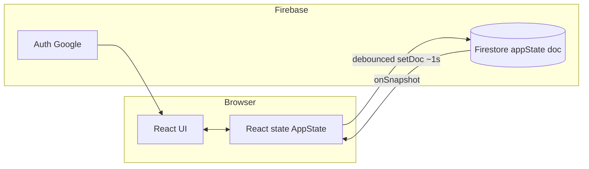

# Salon Startup Planner — Extensive Improvement Plan

This document is a **deep-dive review** of the codebase and a **structured, actionable roadmap**. It is meant to guide engineering prioritization, reduce operational risk, and scale the product from a strong prototype to a maintainable production app.

**How to use this document**

- **Engineering leads**: Work top-down by severity (§3 → §4 → §5), then phases in §14.
- **Product**: Use §8 and §14 Phase C for feature sequencing; tie acceptance criteria to releases.
- **Update cadence**: Revise `schemaVersion` notes and the risk register (§13) after each major release.

---

## Table of contents

1. [Executive summary](#1-executive-summary)
2. [Current system snapshot](#2-current-system-snapshot)
3. [Critical issues (severity: production / legal / data loss)](#3-critical-issues)
4. [High-priority technical debt](#4-high-priority-technical-debt)
5. [Architecture & scalability](#5-architecture--scalability)
6. [Data model, sync, and migrations](#6-data-model-sync-and-migrations)
7. [Type safety, tooling, and developer experience](#7-type-safety-tooling-and-developer-experience)
8. [Product, UX, and accessibility](#8-product-ux-and-accessibility)
9. [Security, privacy, and compliance](#9-security-privacy-and-compliance)
10. [Performance and reliability](#10-performance-and-reliability)
11. [Testing strategy](#11-testing-strategy)
12. [Observability and operations](#12-observability-and-operations)
13. [Risk register](#13-risk-register)
14. [Phased roadmap and backlog](#14-phased-roadmap-and-backlog)
15. [Success metrics and definition of done](#15-success-metrics-and-definition-of-done)
16. [Appendix](#16-appendix)

---

## 1. Executive summary

The application is a **single-tenant-per-Google-account** salon opening planner: tasks grouped by modules, budget tracking (estimated vs actual), opening countdown, brand customization, and **real-time sync** of a single Firestore document per user (`users/{uid}/data/appState`).

**What is working well:** Clear problem fit, polished UI (Tailwind v4, Motion, Recharts), and a simple persistence model that is easy to reason about for a personal or founder-only tool.

**What must be fixed before treating this as production-safe:**

1. **Firestore security rules require `budgetCategories`**, but the TypeScript `AppState` and `INITIAL_DATA` omit it — deployed rules can **reject every write**, breaking sync entirely.
2. **Client error handling** in `handleFirestoreError` **throws** after logging, which encourages unhandled promise rejections and poor user feedback on network or permission failures.
3. **Operational clarity** is missing: no CI, minimal automated checks, and a **monolithic `App.tsx`** (~1,200 lines) that will slow safe iteration.

**Recommended strategic direction:** Stabilize schema + rules + errors (short horizon), then **modularize** the UI and sync layer, then **deepen product** (content library, exports, optional collaboration) behind clear acceptance criteria and tests.

---

## 2. Current system snapshot

### 2.1 Technology stack

| Layer | Choice | Notes |
|-------|--------|--------|
| UI | React 19, Vite 6 | Modern baseline; ensure StrictMode double-effects are accounted for in subscriptions. |
| Styling | Tailwind CSS v4 (`@tailwindcss/vite`) | Design tokens via CSS variables (`--brand-*`) from settings. |
| Motion | `motion` (Motion One / Framer lineage) | Page and modal transitions. |
| Charts | Recharts | Bar chart for module budget allocation. |
| Icons | Lucide React | Module icons referenced by string name + `ICON_MAP`. |
| Auth | Firebase Auth, Google popup | `signInWithPopup`. |
| Database | Cloud Firestore | Single document sync model. |
| AI (declared) | `@google/genai` in `package.json` | **Not referenced in `src/`** — dead dependency unless planned. |

### 2.2 Repository map (logical)

| Path | Role |
|------|------|
| `src/App.tsx` | Auth gate, Firestore subscribe/persist, all tabs, modals, charts — **primary complexity concentration**. |
| `src/constants.ts` | Large `INITIAL_DATA` seed and default roadmap. |
| `src/types.ts` | `AppState`, `Task`, `Module`, `BrandSettings`; includes unused `BudgetCategory` / `BudgetItem` types vs actual usage (tasks carry costs). |
| `src/firebase.ts` | Init, auth helpers, `handleFirestoreError`, connection probe. |
| `src/components/TaskCard.tsx`, `Settings.tsx` | Isolated UI; good candidates to keep thin and presentational. |
| `firestore.rules` | Owner-scoped access + `isValidAppState` validation. |
| `firebase-applet-config.json` | Client Firebase config imported at build time. |

### 2.3 Runtime data flow



**Observations:**

- **Full-document read/write** on each change: simple but amplifies race conditions and bandwidth use as the document grows.
- **`onSnapshot` handler** mutates deserialized data for migrations, then may `setDoc` again — coupling migration logic to every subscription event.

---

## 3. Critical issues

### 3.1 Firestore rules vs. application schema (`budgetCategories`)

**Problem:** `isValidAppState` requires keys including `budgetCategories` (list). The live app state type and seed data do not include this field.

**Impact:** If rules are deployed as in-repo, **writes fail** with permission denied (validation failure). Users may see empty state after sign-in, or edits that never persist — **silent or confusing failure** depending on error handling.

**Resolution paths (pick one explicitly):**

| Option | When to choose | Work items |
|--------|----------------|------------|
| **A — Align app to rules** | You intend a separate budget taxonomy (`BudgetCategory` / `BudgetItem` in `types.ts`) | Add `budgetCategories: []` to `INITIAL_DATA`; extend `AppState`; one-time migration for existing users; optionally build UI later. |
| **B — Align rules to app** | Budget is fully represented by task-level `estimatedCost` / `actualCost` | Remove `budgetCategories` from `isValidAppState` and `firebase-blueprint.json`; redeploy rules; document decision. |
| **C — Hybrid** | You want both roll-up categories and line items | Define canonical model in `types.ts`, migrate tasks into categories or link by `taskId`, update UI and rules together. |

**Acceptance criteria:**

- [ ] New user: first `setDoc` after sign-in succeeds under deployed rules.
- [ ] Existing user: opening app does not produce a permanent permission-denied loop.
- [ ] `firebase-blueprint.json`, `types.ts`, `INITIAL_DATA`, and `firestore.rules` all describe the **same** required fields.

**Verification:**

1. Deploy rules to a **staging** Firebase project.
2. Sign in with a test account; confirm document create/update in Firestore console.
3. Intentionally send a payload missing a required field; confirm **predictable** client error (not a white screen).

---

### 3.2 `handleFirestoreError` throws in the browser

**Problem:** Errors are stringified and re-thrown. Call sites use `.catch(e => handleFirestoreError(...))`, which turns recoverable Firestore errors into thrown `Error` objects unless every path is wrapped.

**Impact:** Unhandled rejections, difficult debugging in production, and **no structured UX** (offline, quota, permission denied).

**Target behavior:**

| Concern | Desired behavior |
|---------|-------------------|
| Offline / transient | Banner or toast: “Changes will sync when you’re back online”; queue or retry with backoff. |
| Permission denied | Clear message: “Session or permissions issue — try signing out and in.” |
| Invalid argument | Developer-facing log + user-safe generic message. |

**Acceptance criteria:**

- [ ] No `throw` from the default error handler used in UI-bound async paths; return a result type or invoke a callback.
- [ ] Optional: integrate **Crashlytics / Sentry / Firebase Analytics events** for `firestore_write_failed` with redacted metadata.

---

### 3.3 Configuration and environments

**Problem:** `firebase-applet-config.json` is committed and imported directly. This is common for client SDKs but complicates **staging vs production**, white-label forks, and rotation workflows.

**Recommendations:**

- Document **which** Firebase project IDs map to which environment.
- Prefer `import.meta.env.VITE_*` (Vite) for config injection in open-source or multi-deploy setups; keep JSON for AI Studio–specific flows if required.
- Ensure `.env.example` lists all required variables (today it emphasizes Gemini; Firebase vars may be missing for non–AI Studio deploys).

---

## 4. High-priority technical debt

### 4.1 Monolithic `App.tsx`

**Symptoms:** Business logic (totals, toggles, modals), layout, Firestore lifecycle, and view-specific markup in one file.

**Target decomposition (illustrative):**

```
src/
  app/
    AppShell.tsx          # sidebar, nav, user menu
    AppRouter.tsx         # tab state or react-router later
  features/
    dashboard/
    tasks/
    budget/
    settings/             # may re-export existing Settings
  hooks/
    useAuthUser.ts
    useFirestoreAppState.ts
  lib/
    cn.ts
    money.ts              # format KD, parse numbers safely
    selectors.ts          # totalBudget, totalSpent, progress
```

**Benefits:** Testable selectors, smaller PRs, clearer ownership, easier lazy loading of heavy tabs (e.g. Recharts).

---

### 4.2 Duplicate utilities and inconsistent patterns

- **`cn()`** duplicated in `App.tsx` and `TaskCard.tsx` → single `lib/cn.ts`.
- **`BudgetCategory` / `BudgetItem` in `types.ts`** appear unused relative to task-embedded costs → remove or implement; avoids confusion during rule/schema fixes.

---

### 4.3 Dead code and dependencies

| Item | Action |
|------|--------|
| `resetTimeline` in `App.tsx` | Wire to Settings (“Reset task dates to template”) or delete. |
| `@google/genai` | Remove from `package.json` or implement a documented AI feature (e.g. task suggestions) with API key hygiene. |
| `express`, `dotenv` | Unused in `src/` — remove unless a server entrypoint is added. |
| `vite` in both `dependencies` and `devDependencies` | Keep in `devDependencies` only for a pure SPA. |

---

### 4.4 TypeScript friction (`React.cloneElement` + icon map)

Module filter chips use `React.cloneElement(ICON_MAP[mod.icon], { size: 16 })`, which fights React’s typing.

**Preferred pattern:** Map icon **names** to **components**:

```ts
const MODULE_ICONS = { Palette, Layout, Scissors, ... } satisfies Record<string, LucideIcon>;
// usage: const Icon = MODULE_ICONS[mod.icon] ?? Palette; <Icon size={16} />
```

---

## 5. Architecture & scalability

### 5.1 State management options (short to medium term)

| Approach | Pros | Cons |
|----------|------|------|
| **Keep React `useState` + lifted state** | Minimal deps; matches current app | Still need disciplined splitting |
| **useReducer + context** | Centralized transitions, easier logging | Boilerplate |
| **TanStack Query + Firestore adapter** | Caching, retries, stale state | Extra abstraction; custom adapter work |
| **Zustand / Jotai** | Simple global store | Another dependency |

**Recommendation:** After extracting hooks, if sync races persist, introduce **either** `useReducer` for `AppState` **or** a tiny store; avoid heavy frameworks until team size warrants it.

### 5.2 Future scaling of Firestore document size

Firestore documents have a **1 MiB** limit. `INITIAL_DATA` is already large; user-generated tasks and future content will grow the blob.

**Mitigations (prioritize as you add features):**

- **Subcollections** per module or per task for very large tenants (changes security rules and queries).
- **Compression** of rarely edited fields (usually unnecessary if you split data).
- **Pruning** old launch-day tasks into an `archivedModules` array with lazy load in UI.

### 5.3 Routing

Today, “tabs” are local state (`activeTab`). For shareable URLs and browser back/forward:

- Introduce **React Router** (or similar) with routes like `/dashboard`, `/tasks`, `/budget`, `/settings`.
- Deep-link to a selected module: `/tasks?module=interior`.

---

## 6. Data model, sync, and migrations

### 6.1 Current sync behavior (simplified)

1. `onAuthStateChanged` sets `user`.
2. `onSnapshot` on `appState` updates local `state`; may `setDoc` when migrations set `hasChanges`.
3. `useEffect` on `[state, user, isSyncing, isLoading]` debounces `setDoc` by 1s.

**Risks:**

- **Echo loops:** Remote update triggers local state update triggers debounced write — usually OK if payload is identical, but still extra writes and cost.
- **Concurrent edits:** Single-user assumption holds for one Google account; two tabs open = last write wins (LWW).

**Improvements:**

- Add **`schemaVersion: number`** to `AppState`. On load, if `schemaVersion < CURRENT`, run pure function `migrate(state) -> newState`, bump version, single write.
- Replace ad hoc string comparisons in migration with versioned steps in `migrations/v1_to_v2.ts` with unit tests.
- Consider **`updateDoc` with dot paths** for high-frequency fields (e.g. `modules.0.tasks.3.actualCost`) to reduce payload size — only after measuring need.

### 6.2 Conflict strategy (document explicitly)

| Mode | Description |
|------|-------------|
| **LWW (current)** | Last debounced save wins — acceptable for single founder, two tabs. |
| **Future multi-user** | Need timestamps per field, operational transform, or server-side merge (Cloud Functions). |

---

## 7. Type safety, tooling, and developer experience

### 7.1 TypeScript `strict` mode (incremental)

Enable in order: `strictNullChecks`, `noImplicitAny`, then full `strict`. Fix Firestore casts (`as AppState`) with **runtime validation** (e.g. Zod) at the boundary.

### 7.2 Linting and formatting

- **ESLint** with `@typescript-eslint`, `eslint-plugin-react-hooks`, `eslint-plugin-jsx-a11y`.
- **Prettier** or **Biome** for format-on-save consistency.

### 7.3 CI pipeline (minimal)

```yaml
# Conceptual steps
npm ci
npm run lint        # tsc + eslint
npm run build
```

Add **Firestore rules tests** (`firebase emulators:exec`) when rules grow complex.

### 7.4 Git hygiene

Repository may be initialized without remote conventions; add **branch protection** and required checks when hosting on GitHub/GitLab.

---

## 8. Product, UX, and accessibility

### 8.1 Honest UI: placeholders vs. features

| Area | Current | Recommendation |
|------|---------|----------------|
| **Content Library** | Static mock items; buttons inert | Hide section behind flag, or implement MVP: list of `{ id, title, type, status, storageUrl? }` in `AppState` + Storage upload. |
| **Hammam card budget** | Hardcoded “8,120 KD” | Derive from tasks (e.g. tag `hammam` or module `interior` + title match) or `AppState.hammamBudgetAllocation`. |
| **Sidebar “On Track”** | Static label | Tie to heuristic: e.g. `% tasks overdue` or budget variance threshold. |

### 8.2 Branding consistency

Login screen copy (“Éclat Salon Planner”) vs. default salon name (“Elegancia”) confuses first impression. Use:

- `APP_DISPLAY_NAME` constant, or
- Generic “Salon Opening Planner” until `brandSettings.salonName` loads post-auth.

### 8.3 Mobile and responsive UX

Sidebar is full-width on small screens — verify tap targets, modal scroll, and budget table horizontal scroll. Consider **bottom nav** on `md` breakpoint and collapsible sidebar.

### 8.4 Accessibility checklist

- [ ] Task status control: **`<button type="button">`** with `aria-pressed` or role `switch` if ternary cycle is kept.
- [ ] Modals: **focus trap**, initial focus on heading or first field, **Escape** closes, return focus to trigger.
- [ ] Charts: **text alternative** or data table toggle for screen readers.
- [ ] Color contrast: validate dynamic brand colors against WCAG (warn in Settings if contrast fails).

### 8.5 Internationalization (i18n)

- Externalize strings; use `Intl` for dates/currency if you add locales beyond EN.
- Arabic content in task titles is fine; ensure **RTL** layout testing if you add an AR locale.

### 8.6 Onboarding

- First-time user: short **3-step coach marks** (tasks, budget, settings) or a dismissible checklist derived from incomplete tasks.

---

## 9. Security, privacy, and compliance

### 9.1 What is already good

- Path-scoped rules: `match /users/{userId}/data/appState` with `isOwner(userId)`.

### 9.2 Hardening opportunities

| Topic | Action |
|-------|--------|
| **Validation depth** | Rules cannot easily validate huge nested maps; add **max string lengths** and **array length** caps where feasible, or validate in Cloud Functions before write. |
| **Logo URL** | Restrict to `https:` in app logic; consider CSP for `img-src`. |
| **PII in Firestore** | Google profile (`displayName`, `photoURL`) is only in Auth UI, not stored in `appState` — good; document if you add client notes with personal data (GDPR-style deletion story). |
| **API keys** | Gemini key in Vite `define` is **client-visible** if ever used in browser — **never** put secret keys in frontend bundles; proxy through Cloud Functions or use AI Studio’s server-side pattern only. |

### 9.3 Backup and export

- **User-facing export** (JSON/CSV of tasks and budget) reduces lock-in and supports compliance requests.
- Periodic **Firestore export** (GCP backup) for business continuity — ops concern, not code.

---

## 10. Performance and reliability

### 10.1 Bundle and runtime

- **Route-level code splitting** (`React.lazy`) for Budget + Charts if initial load feels heavy.
- **Memoize** expensive derived values (already partially done with `useMemo`); ensure `sortedTasks` and chart data are stable where passed to child components.

### 10.2 Firestore costs

- Full-document writes on every debounced change **scale with edit frequency** and document size.
- Add **dirty tracking** (`isDirty` ref) so snapshot application does not schedule unnecessary saves.

### 10.3 Resilience

- **Firestore persistence** (`enableIndexedDbPersistence`) for offline read/write queue — evaluate tradeoffs (multi-tab).

---

## 11. Testing strategy

### 11.1 Unit tests (Vitest recommended, aligns with Vite)

| Target | Examples |
|--------|----------|
| Selectors | `totalBudget`, `totalSpent`, `progressPercent`, days-to-opening edge cases |
| Migrations | `schemaVersion` bumps, `budgetCategories` injection |
| Reducers | `toggleTaskStatus` cycle, `updateActual` with NaN guards |

### 11.2 Component tests (React Testing Library)

- Settings: updating salon name propagates to sidebar title.
- Task modal: validation — disable submit on empty title.

### 11.3 Integration / E2E (Playwright)

- Sign-in flow against **Firebase Auth emulator** (or stubbed auth in CI).
- Create task → assert Firestore emulator document updated.

### 11.4 Firestore rules tests

- Assert **owner cannot write another user’s doc**.
- Assert **invalid payload** rejected after `isValidAppState` is finalized.

---

## 12. Observability and operations

| Signal | Tooling |
|--------|---------|
| Client errors | Sentry / Firebase Crashlytics (if mobile later) |
| Auth funnel | Analytics events: `login_started`, `login_success`, `sync_error` |
| Performance | Web Vitals in production build |
| Firestore | GCP monitoring for read/write counts and errors |

**Runbooks (short):**

1. **Sync broken for all users** → Check rules deployment, `isValidAppState`, breaking schema change.
2. **Single user broken** → Inspect document size (>1 MiB), corrupt fields, manual fix in console.

---

## 13. Risk register

| ID | Risk | Likelihood | Impact | Mitigation |
|----|------|------------|--------|------------|
| R1 | Rules/schema mismatch blocks writes | High if rules deployed | Critical | §3.1 options A/B/C + staging verification |
| R2 | Last-write-wins loses edits (multi-tab) | Medium | Medium | Dirty flags, visibility banner, or CRDT later |
| R3 | Document size approaches 1 MiB | Low now | High | §5.2 split strategy |
| R4 | Client-exposed AI keys if Gemini used in browser | Low until used | Critical | Server proxy only |
| R5 | Placeholder UI erodes trust | Medium | Low–Med | Hide or ship MVP §8.1 |

---

## 14. Phased roadmap and backlog

Effort labels: **S** small (<1 day), **M** (1–3 days), **L** (3–7 days), **XL** (>1 week).

### Phase 0 — Preconditions (same day)

| ID | Task | Effort | Owner |
|----|------|--------|-------|
| P0-1 | Decide `budgetCategories` fate; update rules + types + seed + blueprint in lockstep | S–M | Eng |
| P0-2 | Staging Firebase project + deploy rules; smoke test sign-in and persist | S | Eng |

### Phase A — Stability & trust (week 1)

| ID | Task | Effort | Depends on |
|----|------|--------|------------|
| A-1 | Non-throwing error handler + user-visible sync status banner | M | — |
| A-2 | `schemaVersion` + migration module + tests for migrations | M | P0-1 |
| A-3 | Fix icon map typing (no `cloneElement` for size) | S | — |
| A-4 | Dependency cleanup (`vite` dup, unused packages) | S | — |
| A-5 | `npm run lint` passes in clean CI (`npm ci`) | S | A-3 |

### Phase B — Modularity (weeks 2–3)

| ID | Task | Effort | Depends on |
|----|------|--------|------------|
| B-1 | Extract `useAuthUser` | S | A-1 |
| B-2 | Extract `useFirestoreAppState` (subscribe + debounce + dirty flag) | L | A-2, A-1 |
| B-3 | Split `Dashboard` / `Tasks` / `Budget` / `AppShell` | L | B-2 |
| B-4 | Central `lib/cn.ts`; remove duplicates | S | B-3 |
| B-5 | Optional: React Router + deep links | M | B-3 |

### Phase C — Product depth (prioritized backlog)

| ID | Task | Effort | Notes |
|----|------|--------|-------|
| C-1 | Remove or implement Content Library MVP | M–L | Storage + rules if real |
| C-2 | Dynamic Hammam budget + “on track” heuristic | S–M | §8.1 |
| C-3 | Export JSON/CSV/PDF | M–L | PDF last |
| C-4 | PWA offline shell + icon | M | Complements Firestore persistence |
| C-5 | Task attachments / notes / assignee | L | Moves toward team use |
| C-6 | Multi-user org (custom claims, shared doc) | XL | New security model |

### Phase D — Quality bar (continuous)

| ID | Task | Effort |
|----|------|--------|
| D-1 | ESLint + jsx-a11y + hooks | M |
| D-2 | Vitest unit tests for selectors/migrations | M |
| D-3 | CI: lint + build (+ emulators optional) | S–M |
| D-4 | Playwright critical path | L |

---

## 15. Success metrics and definition of done

### 15.1 Quantitative

- **Firestore write success rate** > 99.9% for authenticated sessions (measured via client logging sample).
- **Lighthouse** performance score target (e.g. >85 on mid-tier mobile) after code splitting if needed.
- **CI green** on default branch for 30 consecutive days.

### 15.2 Qualitative / DoD per feature

- Schema change: rules + types + seed + emulator test + staging manual test.
- New surface: accessibility spot-check (keyboard + screen reader on modal).
- User-visible sync: always show **syncing / synced / error** state.

---

## 16. Appendix

### 16.1 Glossary

- **LWW:** Last-write-wins — later save overwrites earlier without merge.
- **appState document:** Single Firestore document holding the entire planner state for one user.

### 16.2 Open questions for product owner

1. Is **collaboration** (staff, partners) in scope within 6 months?
2. Should **budget** remain task-embedded, or move to formal categories matching accounting?
3. Is **Gemini** intended for in-app features (copy, task breakdown), and if so, **server-side only**?
4. Target **locales** (EN only vs EN+AR UI)?

### 16.3 Related files (quick reference)

- `src/App.tsx` — main application logic and UI
- `src/firebase.ts` — Firebase init and error helper
- `firestore.rules` — server-side validation and access control
- `src/constants.ts` — `INITIAL_DATA`
- `src/types.ts` — `AppState` shape

---

*Last updated: treat this plan as a living document; revise Phase C/D ordering as business priorities change.*
